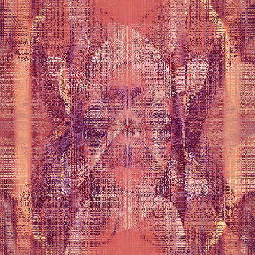
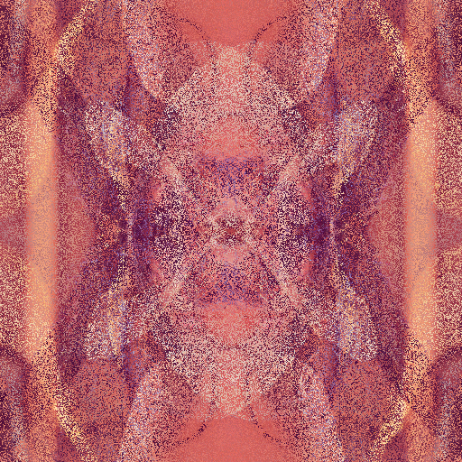

# Erebus

Erebus is a work to help you share content on the internet and preserve your privacy.

## How it works?

|                                                                           |
|:--------------------------------------------------------------------------------------------------------:|
| Lenna or Lena is a standard test image used in the field of image processing since 1973. |

## How to run?

Since Erebus is still under development, only Windows is supported; MAC and Linux will eventually be able to run this.

### Windows

To encrypt an image you can run the following command:

```
./erebus -action protect -inputFile ./input/path/example.png -iterations 1000
```

To decrypt an image you can run the following command:

```
./erebus -action unprotect -inputFile ./input/path/example.png -keyPath ./key/path/example.csv
```

## Results


| **Original**                    | **Encrypted (I = 1000)**             | **Encrypted (I = 2000)**             | **Encrypted (I = 5000)**             |
|:-------------------------------:|:------------------------------------:|:------------------------------------:|:------------------------------------:|
|  |  |  |  |

## Documentation in different languages 🚧

This section is still under construction and it's gonna be released soon.

## External links

1. [Lena (Wikipedia)](https://en.wikipedia.org/wiki/Lenna)