# Erebus

<div align="center">

|                                                                                                                                                                                                                                                                                                                              |
| :-------------------------------------------------------------------------------------------------------------------------------------------------------------------------------------------------------------------------------------------------------------------------------------------------------------------------------------------------: |
| Lenna or Lena is a standard test image used in the field of image processing since 1973. It is a picture of the Swedish model Lena Forsén, shot by photographer Dwight Hooker, cropped from the centerfold of the November 1972 issue of Playboy magazine. In this example we can see what happens behind the scenes during the encryption process. |

</div>

## Abstract

Erebus is a tiny, seed‑driven image scrambler. Given an input image, a random seed, and an iteration count, it applies a deterministic sequence of toroidal row/column rotations: on each step it picks a direction (up/down/left/right), a pivot row or column, and a shift amount, then cyclically rotates those pixels. Colors are never changed—only pixel positions are permuted—so running with the same seed and iterations reproduces the exact result, and the transform is theoretically reversible if you apply the inverse steps.

## Introduction

Erebus derives from an older version called [erebus.m](https://github.com/memburg/erebus.m), a simpler version of Erebus written in MATLAB.

Erebus is an experiment in pixel permutation using only simple wrap-around shifts. With a seed and a step count, it produces the same shuffled arrangement every run while never altering any color values. Because only positions change, structure can reappear with appropriate parameters, and an exact inverse exists in principle. It is useful for reproducible art, pedagogy around permutations, and lightweight obfuscation—though it is not cryptographic security.

## Usage

- Requirements: JRuby.
- CLI: `jruby src/erebus.rb <image_or_folder> <seed> <iterations>`
- Help: `jruby src/erebus.rb -h`

### Single image

```bash
# Cipher (default)
jruby src/erebus.rb assets/lenna.png 42 1500
# Output: assets/c-lenna.png

# Decipher
jruby src/erebus.rb assets/c-lenna.png 42 1500 -m=decipher
# Output: assets/d-c-lenna.png
```

### Bulk (folder)

```bash
# Cipher a folder of images
jruby src/erebus.rb my-folder 42 1500
# Output: written to my-folder-output/ (sibling directory, e.g. my-folder-output/c-cat.png)

# Decipher
jruby src/erebus.rb my-folder 42 1500 -m=decipher
# Output: written to my-folder-output/ (e.g. my-folder-output/d-c-cat.png)
```

Notes:
- Only pixel positions change; running with the same seed and iterations reproduces the same arrangement for a given image size.
- Java ImageIO natively supports PNG, GIF, JPEG, BMP, and WBMP.

## Iterations

These grids summarize the effect of increasing the step budget across images. Iteration counts are size-normalized: `1w` means width steps, `1h` means height steps; hence `1w + 1h` equals width plus height steps, and `2w + 2h` is approximately one perimeter-length budget. This normalization enables direct comparison across images; equal formulas (e.g., `2w + 1h`) indicate comparable mixing effort for images of the same dimensions, while the visible outcome remains content-dependent.
 
### female.png

|         Original         |                1w or 1h                |                1w + 1h                 |                2w + 1h                 |                2w + 2h                 |
| :----------------------: | :------------------------------------: | :------------------------------------: | :------------------------------------: | :------------------------------------: |
| 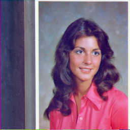 | 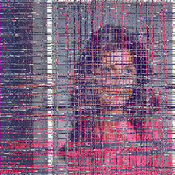 | 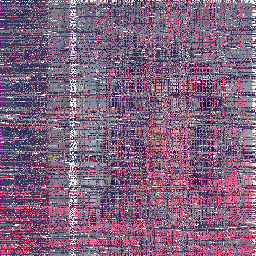 | 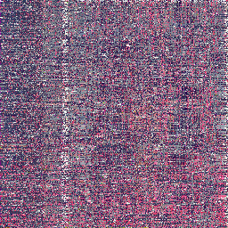 | 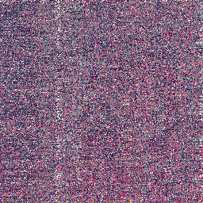 |

### mandrill.png

|          Original          |                 1w or 1h                 |                 1w + 1h                  |                 2w + 1h                  |                 2w + 2h                  |
| :------------------------: | :--------------------------------------: | :--------------------------------------: | :--------------------------------------: | :--------------------------------------: |
| 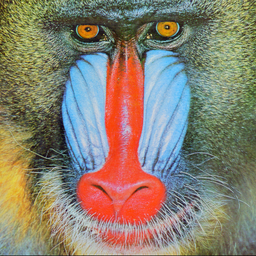 | 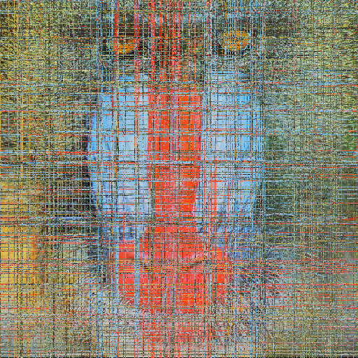 | 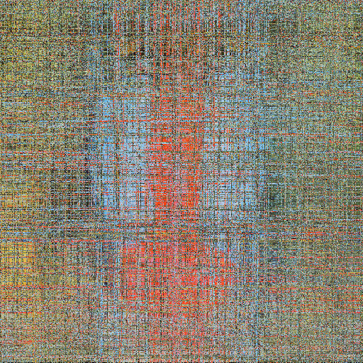 | 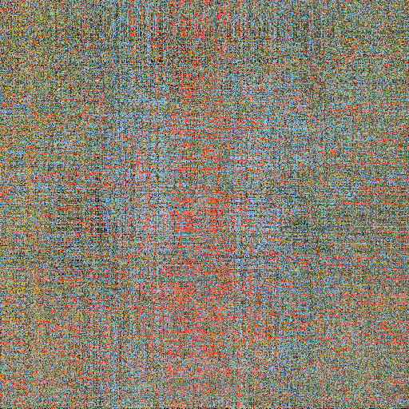 | 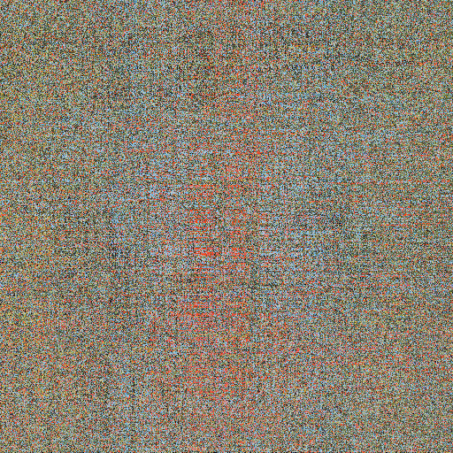 |

### male.png

|        Original        |               1w or 1h               |               1w + 1h                |               2w + 1h                |               2w + 2h                |
| :--------------------: | :----------------------------------: | :----------------------------------: | :----------------------------------: | :----------------------------------: |
| 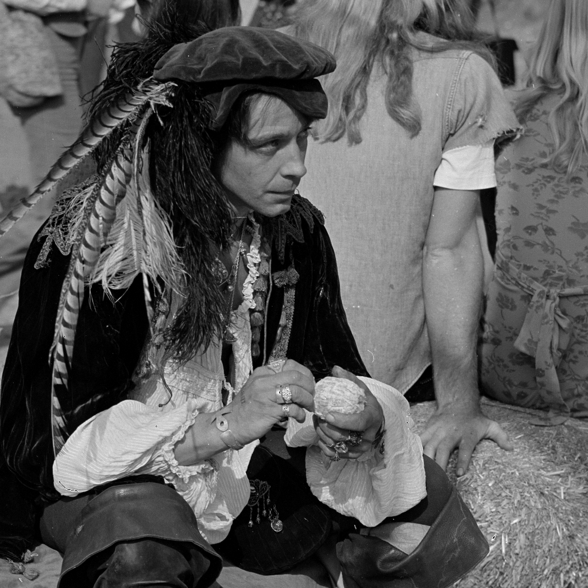 | 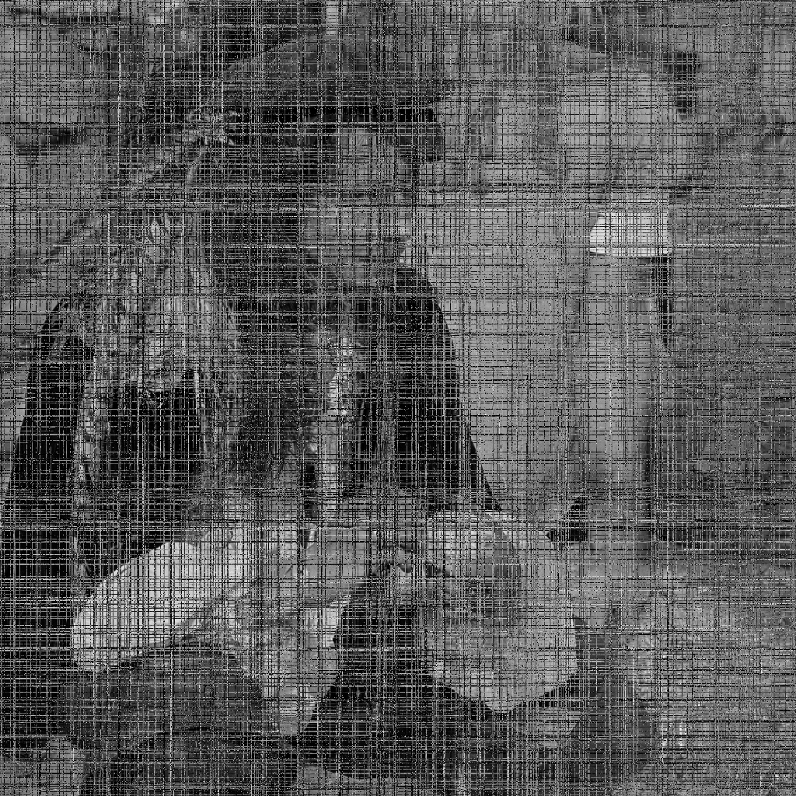 | 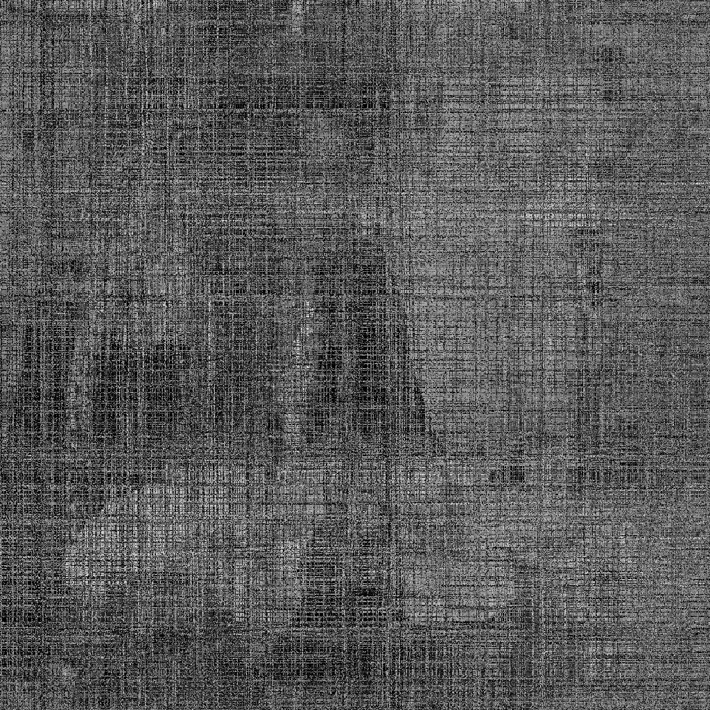 | 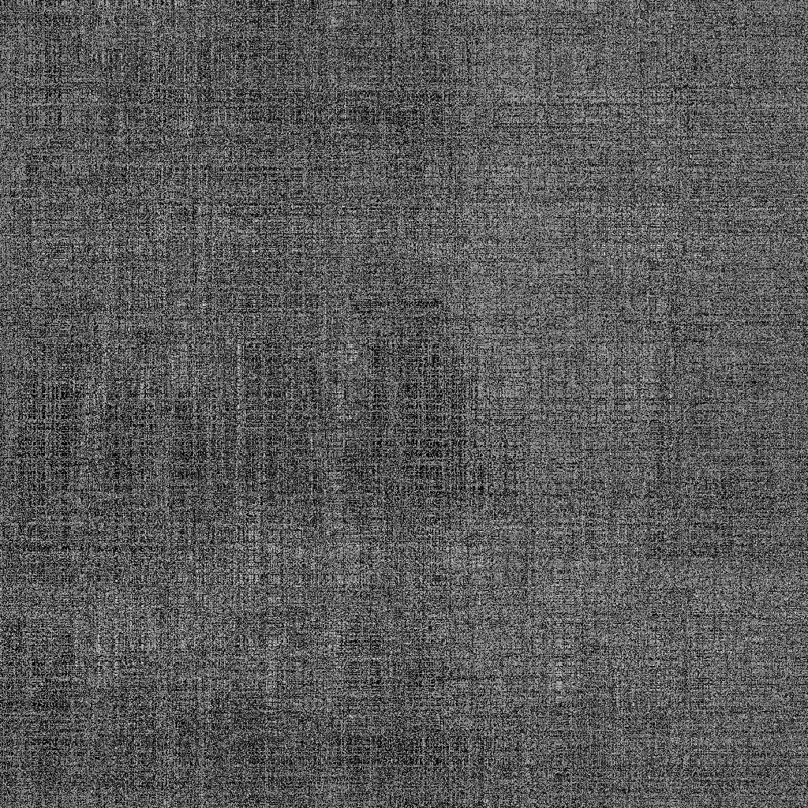 | 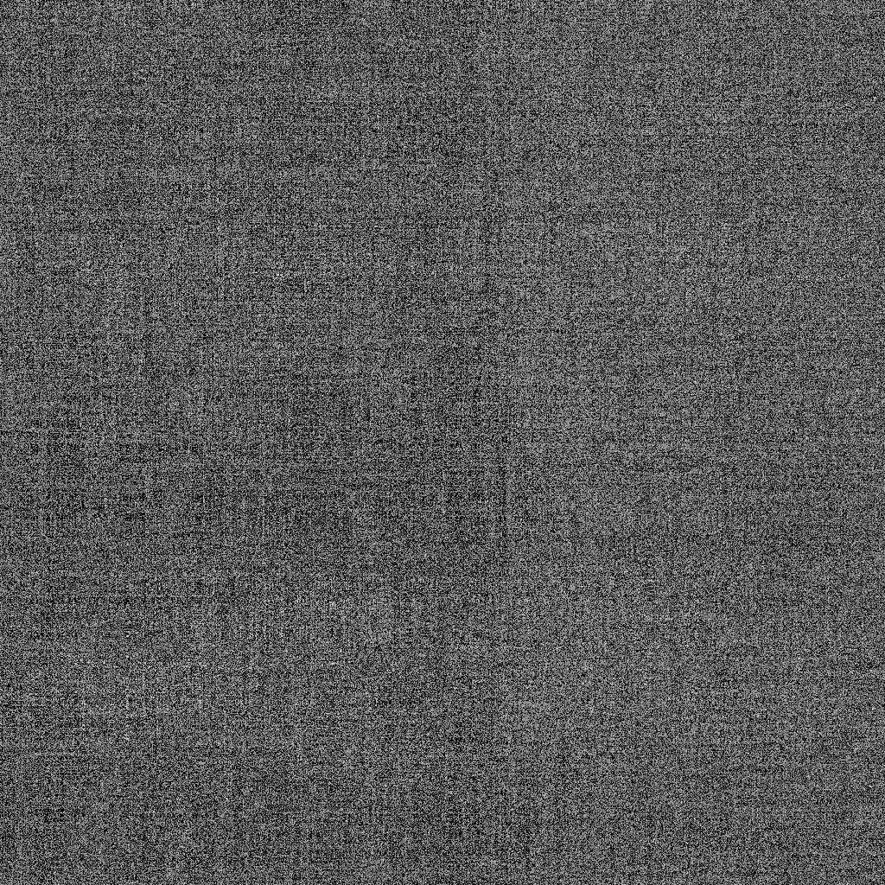 |

## Performance

Performance depends on CPU, memory bandwidth, and the JVM, so times vary by system; however, concrete numbers help set expectations. Each step rotates a single row or column, so runtime scales approximately with iterations × (width + height). The table below reports historical timings from the Python version; results on JRuby will differ.

### 1w or 1h

| Image        | Size      | Iterations | Encryption time | Decryption time |
| ------------ | --------- | ---------- | --------------- | --------------- |
| female.png   | 256x256   | 256        | 0.266100        | TBD             |
| mandrill.png | 512x512   | 512        | 0.633300        | TBD             |
| male.png     | 1024x1024 | 1024       | 2.158500        | TBD             |

### 1w + 1h

| Image        | Size      | Iterations | Encryption time | Decryption time |
| ------------ | --------- | ---------- | --------------- | --------------- |
| female.png   | 256x256   | 512        | 0.384200        | TBD             |
| mandrill.png | 512x512   | 1024       | 1.100400        | TBD             |
| male.png     | 1024x1024 | 2048       | 4.071000        | TBD             |

### 2w + 1h

| Image        | Size      | Iterations | Encryption time | Decryption time |
| ------------ | --------- | ---------- | --------------- | --------------- |
| female.png   | 256x256   | 768        | 0.500800        | TBD             |
| mandrill.png | 512x512   | 1536       | 1.580900        | TBD             |
| male.png     | 1024x1024 | 3072       | 6.010700        | TBD             |

### 2w + 2h (perimeter)

| Image        | Size      | Iterations | Encryption time | Decryption time |
| ------------ | --------- | ---------- | --------------- | --------------- |
| female.png   | 256x256   | 1024       | 0.616300        | TBD             |
| mandrill.png | 512x512   | 2048       | 2.084600        | TBD             |
| male.png     | 1024x1024 | 4096       | 8.044000        | TBD             |

### System specs

```
OS: macOS 15.6.1 24G90 arm64
Host: Mac16,10
Kernel: 24.6.0
CPU: Apple M4
GPU: Apple M4
Memory: 2270MiB / 16384MiB
```

## Video encryption

Video encryption is possible as well, not directly using Erebus but using a tool like `ffmpeg`.

Splitting the original video into frames, then encrypting the frames and reassembling them using the same frame rate as the original video.

| Original                   | Encrypted                     |
| -------------------------- | ----------------------------- |
|  |  |

> [!NOTE]
> I do not own the rights to the above video; it was made for educational purposes.

### Helpful commands

```bash
# extract every original frame
mkdir -p frames && ffmpeg -i "input.mp4" -vsync 0 "frames/frame_%06d.png"

# rebuild the video (no audio)
ffmpeg -framerate "$(ffprobe -v error -select_streams v:0 -show_entries stream=avg_frame_rate -of csv=p=0 "input.mp4")" -start_number 1 -i "frames/frame_%06d.png" -c:v libx264 -pix_fmt yuv420p "reassembled.mp4"
```

> [!NOTE]
> The video were converted into GIFs to be rendered by the markdown interpreter.

## Vision LLMs test

A minimal, model-only evaluation was conducted using female.png, with no expectation of significant findings. Because this is not a human-subjects assessment, the outcomes should not be interpreted as evidence that humans cannot recognize a ciphered (encrypted) image.

The prompt below was provided to multiple LLMs:

```
You are an expert visual analyst.

Carefully examine the image provided and produce a single, continuous paragraph that describes exactly what you see.

Your description must:

- Focus only on visible elements (do not guess intent, emotions, or backstory).
- Include objects, people, environment, colors, lighting, perspective, composition, textures, and spatial relationships.
- Mention relative positions, sizes, and notable details.
- Be neutral, precise, and literal, as if describing the image to someone who cannot see it.
- Avoid bullet points, lists, or line breaks.
- Avoid speculation, symbolism, or interpretation.
- Output only one paragraph and nothing else.
```

### ministral-3

#### Original female image

The image depicts a young woman positioned centrally against a plain, light-colored background that appears to be a studio backdrop with subtle vertical lines or shadows near the edges. She has shoulder-length, dark brown hair with natural waves and bangs that frame her forehead, parted slightly to the left. Her attire consists of a collared, short-sleeved blouse in a solid pink hue, which contrasts with her skin tone. The lighting is even and soft, casting minimal shadows, with the primary illumination coming from above and slightly to the front, illuminating her face evenly while leaving the background uniformly lit without distinct highlights or gradients. The composition is symmetrical, with her head and shoulders occupying most of the frame, and her gaze directed straight at the camera with a neutral expression. No other objects, textures, or environmental details are visible beyond her and the backdrop.

#### Female image after 256 iterations

The image depicts a heavily pixelated and distorted portrait overlaid on a blurred urban environment, creating a layered, fragmented visual effect. The central figure appears to be a person with short hair, partially visible through a grid-like interference pattern composed of irregular, overlapping lines in shades of red, pink, and white, which obscure the face and body with a mosaic of translucent squares and rectangles. The background consists of a densely packed, low-resolution grid of grayscale pixels, resembling a degraded digital scan or a heavily compressed image, with faint outlines of vertical and horizontal lines forming a grid-like texture. Beneath this, a slightly clearer but still pixelated urban scene is discernible, showing indistinct buildings, windows, and street-level details rendered in muted grays and soft blues, suggesting a cityscape viewed from a distance or through a screen. The overall composition lacks sharp focus, with the foreground’s pixelated overlay dominating the visual field and creating a sense of depth through conflicting resolutions, where the human figure and background merge into a single, abstracted, high-contrast texture.

#### Female image after 512 iterations

The image depicts a highly abstract, densely layered composition featuring a chaotic arrangement of vertical and horizontal lines, shapes, and textural elements rendered in a predominantly monochromatic palette with subtle variations. The dominant background consists of a dark, almost indigo-gray base, interspersed with faint, irregular grid-like structures that create a sense of depth and fragmentation. Overlaying this are numerous overlapping, irregularly spaced lines—some straight, others slightly curved or jagged—drawn in a muted, charcoal-gray hue, which converge and diverge in a seemingly random yet structured pattern. Scattered throughout are clusters of text-like characters and symbols, rendered in a lighter, off-white or pale pinkish tone, appearing slightly translucent against the darker backdrop, with some elements appearing slightly blurred or smudged as if partially erased or overlaid. The composition lacks clear focal points, with no discernible objects, figures, or recognizable scenes, instead emphasizing a dense, textured interplay of lines and marks that create a sense of visual noise. The overall effect is one of complexity and disarray, with no evident perspective or spatial cues to suggest depth or a three-dimensional environment, instead presenting a flat, layered surface dominated by contrast and repetition.

### qwen3-vl

#### Original female image

The image depicts a portrait of a person with long, wavy dark brown hair wearing a bright pink polo shirt with white buttons, positioned slightly to the right of the image’s center. To the left of the person, a narrow vertical panel of dark gray or black is visible, adjacent to the subject’s left shoulder, while the background to the right of the person features a light blue-gray gradient with a subtle texture. The person’s hair has defined curls and a smooth texture, and the shirt appears crisp with a visible collar and buttoned placket. The lighting is even and diffused, creating soft illumination without harsh shadows, and the perspective is straight-on, typical of a studio portrait. The composition places the subject in the foreground against the dual-background elements, with the dark vertical panel occupying a smaller width compared to the broader blue-gray backdrop behind the person.

#### Female image after 256 iterations

The image is dominated by a dense grid of intersecting horizontal and vertical lines in varying shades of purple, pink, blue, and white, creating a digital interference pattern that overlays the entire frame. Within this pattern, a figure is centered, wearing a solid red top; the figure’s face is partially visible with dark hair and a neutral facial structure, though the grid obscures fine details. To the left and right of the figure, vertical elements resembling structural supports or building facades are visible in muted gray and blue tones, appearing as blurred, rectangular shapes. The lighting is even with no discernible highlights or shadows, contributing to a flat visual texture. The composition places the figure in the middle of the frame, with the grid lines extending across the entire image, obscuring the background and foreground elements. The texture is characterized by the layered digital noise, which disrupts the clarity of all visible objects, creating a fragmented visual field where the figure and background elements are barely distinguishable through the overlapping lines.

#### Female image after 512 iterations

The image is a dense digital glitch art composition dominated by overlapping vertical and horizontal text fragments, rendered in a chaotic grid pattern with pixelated, static-like textures. Visible colors include muted pinks, purples, grays, and black, with subtle red accents in certain sections, creating a layered, fragmented visual field where individual words or characters are indiscernible due to distortion and overlapping. The composition fills the entire frame without negative space, with vertical text strips running top to bottom interspersed with horizontal lines, resulting in a non-uniform density where some areas are more concentrated with text fragments than others. The texture appears corrupted, resembling digital noise or a malfunctioning screen, with no clear focal point or perspective, as all elements are presented in a flat, two-dimensional arrangement with no discernible depth or spatial hierarchy between the overlapping layers.

### gemma3

#### Original female image

The image is a frontal, medium-shot photograph of a young woman with long, voluminous, light brown, wavy hair that cascades past her shoulders, occupying approximately two-thirds of the frame’s height. She is wearing a bright pink, short-sleeved shirt that fits closely to her torso and has a crew neck. The shirt’s fabric appears smooth and slightly reflective, and the pink color dominates the scene. The woman is positioned centrally within the frame, with her head and upper torso occupying the majority of the visible space. Behind her is a plain, light gray background with subtle variations in tone, creating a neutral backdrop. The lighting appears soft and diffused, illuminating her face and shirt evenly without harsh shadows. The perspective is straightforward, presenting a direct, eye-level view with no visible depth cues or distortion. The composition is simple and balanced, with the woman’s form filling most of the frame, and there are no other discernible objects or elements within the image.

#### Female image with 256 iterations

The image depicts a young person, facing the left, positioned centrally within a rectangular frame. The individual is wearing a pink shirt, the fabric appearing smooth and soft in texture, and has dark hair that falls to the shoulders. Behind the person is a gray wall with a vertical white line running from the lower third to the upper third of the frame, creating a strong linear element that bisects the scene. The wall extends to the upper edge of the frame, and the lower portion of the wall is partially visible. The lighting appears to be diffuse and even, casting minimal shadows and highlighting the pink color of the shirt. The perspective is frontal, presenting a straightforward view of the subject with no discernible depth of field. The composition is symmetrical, with the person's head and shoulders occupying the central area of the frame.

#### Female image after 512 iterations

The image depicts a bright, open-air scene dominated by a large, white, rectangular object positioned centrally, occupying the majority of the frame. This object, likely a wall or a large panel, is partially obscured by a dense, reddish-brown, textured surface resembling corrugated metal, extending from the lower left corner towards the upper right. Within the reddish-brown area, several dark, amorphous shapes, possibly representing figures or objects, are scattered irregularly. A white, vertical line runs from the lower left to the upper right, intersecting the reddish-brown surface and extending along the white rectangular object. The lighting appears to be bright and diffuse, casting minimal shadows and illuminating the entire scene with a flat, even quality. The perspective is relatively straightforward, with no significant vanishing points or strong sense of depth, and the composition emphasizes the interaction between the white rectangular element and the textured reddish-brown surface, creating a spatial relationship where the white object appears to float within the texture.

## Conclusion

Erebus demonstrates that a seed and iteration-parameterized sequence of toroidal row/column rotations is sufficient to produce visually non-trivial permutations while remaining exactly reversible. In practice, this enables casual concealment of images: given knowledge of the seed (key) and the iteration count, the original can be recovered deterministically without loss.

From a security standpoint, exhaustive search over plausible seeds and iteration counts can be computationally demanding when the key space is large and iteration budgets are high, which provides some resistance to naive brute-force attempts. Nonetheless, Erebus is a permutation-only cipher, not modern cryptographic encryption. It preserves pixel values and associated statistics, and it offers no formal security guarantees under standard adversarial models; it should not be used to protect sensitive data.

Operationally, the method is lightweight and easy to use: a single command reproduces or inverts a transform on any supported image, and size-normalized iteration budgets facilitate comparable mixing across resolutions. This combination of determinism, reproducibility, and simplicity makes Erebus suitable for pedagogical demonstrations, procedurally generated art, and low-stakes obfuscation scenarios where cryptographic assurances are not required.

## Credits

1. [Lenna](https://en.wikipedia.org/wiki/Lenna)
2. [SIPI Image Database](https://sipi.usc.edu/database/)
