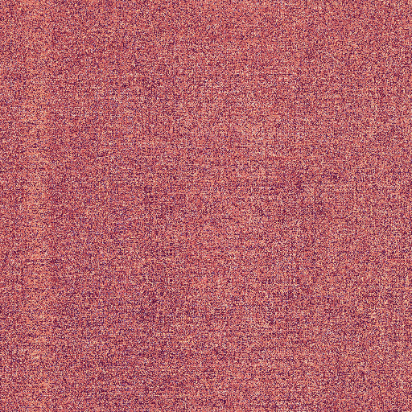

# Erebus

## Abstract

Erebus is a tiny, seed‑driven image scrambler. Given an input image, a random seed, and an iteration count, it applies a deterministic sequence of toroidal row/column rotations: on each step it picks a direction (up/down/left/right), a pivot row or column, and a shift amount, then cyclically rotates those pixels. Colors are never changed—only pixel positions are permuted—so running with the same seed and iterations reproduces the exact result, and the transform is theoretically reversible if you apply the inverse steps.

<!-- <p align="center">
    
    
</p> -->

## Performance

Performance depends on CPU, memory bandwidth, and Python/Tk build, so times vary by system; however, concrete numbers help set expectations. Each step rotates a single row or column, so runtime scales approximately with iterations × (width + height). The table below reports average timings from a reference system (specs included) as an indicative baseline; results on other systems may differ.

### 1w or 1h

| Image        | Size      | Iterations | Time (seconds) |
| ------------ | --------- | ---------- | -------------- |
| female.png   | 256x256   | 256        | 0.266100       |
| mandrill.png | 512x512   | 512        | 0.633300       |
| male.png     | 1024x1024 | 1024       | 2.158500       |

### 1w + 1h

| Image        | Size      | Iterations | Time (seconds) |
| ------------ | --------- | ---------- | -------------- |
| female.png   | 256x256   | 512        | 0.384200       |
| mandrill.png | 512x512   | 1024       | 1.100400       |
| male.png     | 1024x1024 | 2048       | 4.071000       |

### 2w + 1h

| Image        | Size      | Iterations | Time (seconds) |
| ------------ | --------- | ---------- | -------------- |
| female.png   | 256x256   | 768        | 0.500800       |
| mandrill.png | 512x512   | 1536       | 1.580900       |
| male.png     | 1024x1024 | 3072       | 6.010700       |

### 2w + 2h

| Image        | Size      | Iterations | Time (seconds) |
| ------------ | --------- | ---------- | -------------- |
| female.png   | 256x256   | 1024       | 0.616300       |
| mandrill.png | 512x512   | 2048       | 2.084600       |
| male.png     | 1024x1024 | 4096       | 8.044000       |

### System specs

```
OS: macOS 15.6.1 24G90 arm64
Host: Mac16,10
Kernel: 24.6.0
CPU: Apple M4
GPU: Apple M4
Memory: 2270MiB / 16384MiB
```

## Vision LLMs test

### mistral-3
### qwen3-vl
### gemma3
